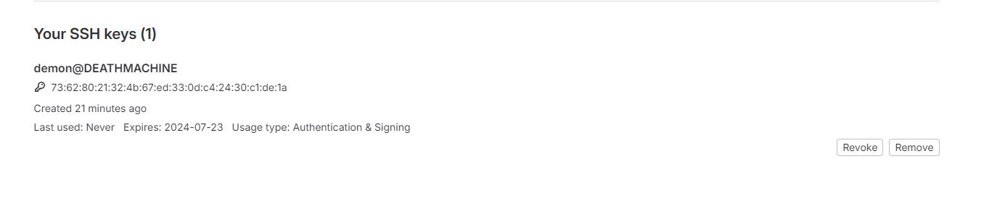

# Автор: Федорчук Дмитрий Сергеевич DEVOPS-33

# Домашнее задание к занятию «Основы Git»

## Задание 1. Знакомимся с GitLab и Bitbucket

Из-за сложности доступа к Bitbucket в работе достаточно использовать два репозитория: GitHub и GitLab.

Иногда при работе с Git-репозиториями надо настроить свой локальный репозиторий так, чтобы можно было 
отправлять и принимать изменения из нескольких удалённых репозиториев. 

Это может понадобиться при работе над проектом с открытым исходным кодом, если автор проекта не даёт права на запись в основной репозиторий.

Также некоторые распределённые команды используют такой принцип работы, когда каждый разработчик имеет свой репозиторий, а в основной репозиторий пушатся только конечные результаты 
работы над задачами. 

### GitLab

Создадим аккаунт в GitLab, если у вас его ещё нет:

1. GitLab. Для [регистрации](https://gitlab.com/users/sign_up)  можно использовать аккаунт Google, GitHub и другие. 
2. После регистрации или авторизации в GitLab создайте новый проект, нажав на ссылку `Create a projet`. 
Желательно назвать также, как и в GitHub — `devops-netology` и `visibility level`, выбрать `Public`.
3. Галочку `Initialize repository with a README` лучше не ставить, чтобы не пришлось разрешать конфликты.
4. Если вы зарегистрировались при помощи аккаунта в другой системе и не указали пароль, то увидите сообщение:
`You won't be able to pull or push project code via HTTPS until you set a password on your account`. 
Тогда перейдите [по ссылке](https://gitlab.com/profile/password/edit) из этого сообщения и задайте пароль. 
Если вы уже умеете пользоваться SSH-ключами, то воспользуйтесь этой возможностью (подробнее про SSH мы поговорим в следующем учебном блоке).
5. Перейдите на страницу созданного вами репозитория, URL будет примерно такой:
https://gitlab.com/YOUR_LOGIN/devops-netology. Изучите предлагаемые варианты для начала работы в репозитории в секции
`Command line instructions`. 
6. Запомните вывод команды `git remote -v`.
7. Из-за того, что это будет наш дополнительный репозиторий, ни один вариант из перечисленных в инструкции (на странице 
вновь созданного репозитория) нам не подходит. Поэтому добавляем этот репозиторий, как дополнительный `remote`, к созданному
репозиторию в рамках предыдущего домашнего задания:
`git remote add gitlab https://gitlab.com/YOUR_LOGIN/devops-netology.git`.
8. Отправьте изменения в новый удалённый репозиторий `git push -u gitlab main`.
9. Обратите внимание, как изменился результат работы команды `git remote -v`.

#### Как изменить видимость репозитория в GitLab — сделать его публичным

* На верхней панели выберите «Меню» -> «Проекты» и найдите свой проект.
* На левой боковой панели выберите «Настройки» -> «Основные».
* Разверните раздел «Видимость» -> «Функции проекта» -> «Разрешения».
* Измените видимость проекта на Public.
* Нажмите «Сохранить изменения».

### Bitbucket* (задание со звёздочкой) 

Это самостоятельное задание, его выполнение необязательно.
____

Теперь необходимо проделать всё то же самое с [Bitbucket](https://bitbucket.org/). 

1. Обратите внимание, что репозиторий должен быть публичным — отключите галочку `private repository` при создании репозитория.
2. На вопрос `Include a README?` отвечайте отказом. 
3. В отличии от GitHub и GitLab в Bitbucket репозиторий должен принадлежать проекту, поэтому во время создания репозитория 
надо создать и проект, который можно назвать, например, `netology`.
4. Аналогично GitLab на странице вновь созданного проекта выберите `https`, чтобы получить ссылку, и добавьте этот репозиторий, как 
`git remote add bitbucket ...`.
5. Обратите внимание, как изменился результат работы команды `git remote -v`.

Если всё проделано правильно, то результат команды `git remote -v` должен быть следующий:

```bash
$ git remote -v
bitbucket https://andreyborue@bitbucket.org/andreyborue/devops-netology.git (fetch)
bitbucket https://andreyborue@bitbucket.org/andreyborue/devops-netology.git (push)
gitlab	  https://gitlab.com/andrey.borue/devops-netology.git (fetch)
gitlab	  https://gitlab.com/andrey.borue/devops-netology.git (push)
origin	  https://github.com/andrey-borue/devops-netology.git (fetch)
origin	  https://github.com/andrey-borue/devops-netology.git (push)
```

Дополнительно можете добавить удалённые репозитории по `ssh`, тогда результат будет примерно такой:

```bash
git remote -v
bitbucket	git@bitbucket.org:andreyborue/devops-netology.git (fetch)
bitbucket	git@bitbucket.org:andreyborue/devops-netology.git (push)
bitbucket-https	https://andreyborue@bitbucket.org/andreyborue/devops-netology.git (fetch)
bitbucket-https	https://andreyborue@bitbucket.org/andreyborue/devops-netology.git (push)
gitlab	git@gitlab.com:andrey.borue/devops-netology.git (fetch)
gitlab	git@gitlab.com:andrey.borue/devops-netology.git (push)
gitlab-https	https://gitlab.com/andrey.borue/devops-netology.git (fetch)
gitlab-https	https://gitlab.com/andrey.borue/devops-netology.git (push)
origin	git@github.com:andrey-borue/devops-netology.git (fetch)
origin	git@github.com:andrey-borue/devops-netology.git (push)
origin-https	https://github.com/andrey-borue/devops-netology.git (fetch)
origin-https	https://github.com/andrey-borue/devops-netology.git (push)
```

Выполните push локальной ветки `main` в новые репозитории. 

Подсказка: `git push -u gitlab main`. На этом этапе история коммитов во всех трёх репозиториях должна совпадать.


## Решение 1.

1. Зарегистрировался в GitLab. Ссылка на профиль: https://gitlab.com/DemoniumBlack
2. Создал публичный репозиторий devops-netology: https://gitlab.com/DemoniumBlack/devops-netology
3. README.md не добавлял при создании репозитория.
4. Аккаунт регистрировал самостоятельный, с введением логина и пароля. Ключ SSH создал и добавил в настройки профиля:



5. Посмотрел предлагаемые в профиле команды в секции Command line instructions.

6. 