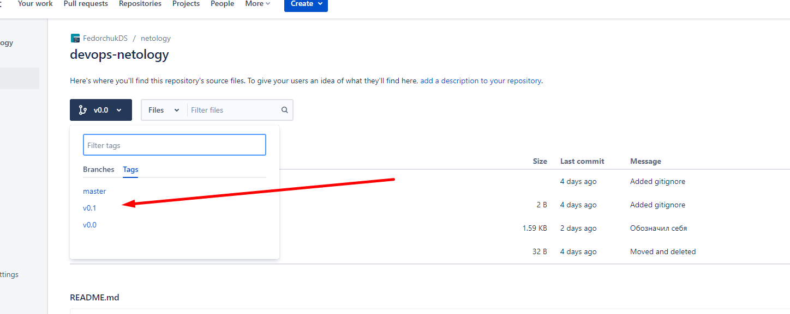
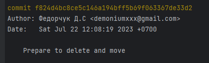
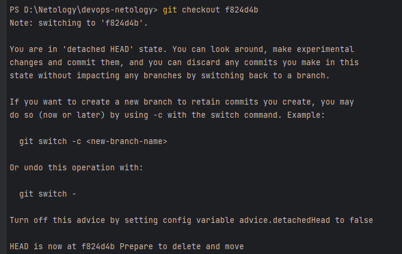
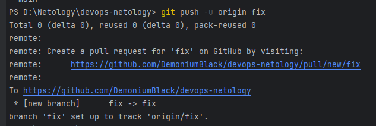
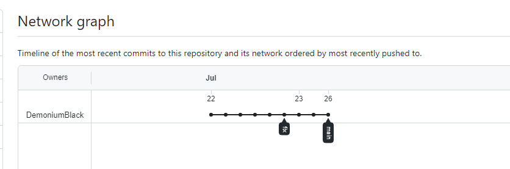
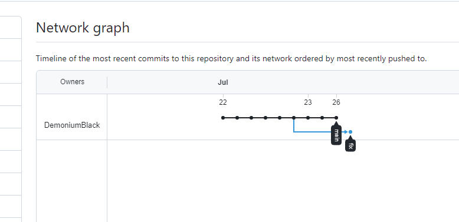

# Автор: Федорчук Дмитрий Сергеевич DEVOPS-33

# Домашнее задание к занятию «Основы Git»

## Задание 1. Знакомимся с GitLab и Bitbucket

Из-за сложности доступа к Bitbucket в работе достаточно использовать два репозитория: GitHub и GitLab.

Иногда при работе с Git-репозиториями надо настроить свой локальный репозиторий так, чтобы можно было 
отправлять и принимать изменения из нескольких удалённых репозиториев. 

Это может понадобиться при работе над проектом с открытым исходным кодом, если автор проекта не даёт права на запись в основной репозиторий.

Также некоторые распределённые команды используют такой принцип работы, когда каждый разработчик имеет свой репозиторий, а в основной репозиторий пушатся только конечные результаты 
работы над задачами. 

### GitLab

Создадим аккаунт в GitLab, если у вас его ещё нет:

1. GitLab. Для [регистрации](https://gitlab.com/users/sign_up)  можно использовать аккаунт Google, GitHub и другие. 
2. После регистрации или авторизации в GitLab создайте новый проект, нажав на ссылку `Create a projet`. 
Желательно назвать также, как и в GitHub — `devops-netology` и `visibility level`, выбрать `Public`.
3. Галочку `Initialize repository with a README` лучше не ставить, чтобы не пришлось разрешать конфликты.
4. Если вы зарегистрировались при помощи аккаунта в другой системе и не указали пароль, то увидите сообщение:
`You won't be able to pull or push project code via HTTPS until you set a password on your account`. 
Тогда перейдите [по ссылке](https://gitlab.com/profile/password/edit) из этого сообщения и задайте пароль. 
Если вы уже умеете пользоваться SSH-ключами, то воспользуйтесь этой возможностью (подробнее про SSH мы поговорим в следующем учебном блоке).
5. Перейдите на страницу созданного вами репозитория, URL будет примерно такой:
https://gitlab.com/YOUR_LOGIN/devops-netology. Изучите предлагаемые варианты для начала работы в репозитории в секции
`Command line instructions`. 
6. Запомните вывод команды `git remote -v`.
7. Из-за того, что это будет наш дополнительный репозиторий, ни один вариант из перечисленных в инструкции (на странице 
вновь созданного репозитория) нам не подходит. Поэтому добавляем этот репозиторий, как дополнительный `remote`, к созданному
репозиторию в рамках предыдущего домашнего задания:
`git remote add gitlab https://gitlab.com/YOUR_LOGIN/devops-netology.git`.
8. Отправьте изменения в новый удалённый репозиторий `git push -u gitlab main`.
9. Обратите внимание, как изменился результат работы команды `git remote -v`.

#### Как изменить видимость репозитория в GitLab — сделать его публичным

* На верхней панели выберите «Меню» -> «Проекты» и найдите свой проект.
* На левой боковой панели выберите «Настройки» -> «Основные».
* Разверните раздел «Видимость» -> «Функции проекта» -> «Разрешения».
* Измените видимость проекта на Public.
* Нажмите «Сохранить изменения».

### Bitbucket* (задание со звёздочкой) 

Это самостоятельное задание, его выполнение необязательно.
____

Теперь необходимо проделать всё то же самое с [Bitbucket](https://bitbucket.org/). 

1. Обратите внимание, что репозиторий должен быть публичным — отключите галочку `private repository` при создании репозитория.
2. На вопрос `Include a README?` отвечайте отказом. 
3. В отличии от GitHub и GitLab в Bitbucket репозиторий должен принадлежать проекту, поэтому во время создания репозитория 
надо создать и проект, который можно назвать, например, `netology`.
4. Аналогично GitLab на странице вновь созданного проекта выберите `https`, чтобы получить ссылку, и добавьте этот репозиторий, как 
`git remote add bitbucket ...`.
5. Обратите внимание, как изменился результат работы команды `git remote -v`.

Если всё проделано правильно, то результат команды `git remote -v` должен быть следующий:

```bash
$ git remote -v
bitbucket https://andreyborue@bitbucket.org/andreyborue/devops-netology.git (fetch)
bitbucket https://andreyborue@bitbucket.org/andreyborue/devops-netology.git (push)
gitlab	  https://gitlab.com/andrey.borue/devops-netology.git (fetch)
gitlab	  https://gitlab.com/andrey.borue/devops-netology.git (push)
origin	  https://github.com/andrey-borue/devops-netology.git (fetch)
origin	  https://github.com/andrey-borue/devops-netology.git (push)
```

Дополнительно можете добавить удалённые репозитории по `ssh`, тогда результат будет примерно такой:

```bash
git remote -v
bitbucket	git@bitbucket.org:andreyborue/devops-netology.git (fetch)
bitbucket	git@bitbucket.org:andreyborue/devops-netology.git (push)
bitbucket-https	https://andreyborue@bitbucket.org/andreyborue/devops-netology.git (fetch)
bitbucket-https	https://andreyborue@bitbucket.org/andreyborue/devops-netology.git (push)
gitlab	git@gitlab.com:andrey.borue/devops-netology.git (fetch)
gitlab	git@gitlab.com:andrey.borue/devops-netology.git (push)
gitlab-https	https://gitlab.com/andrey.borue/devops-netology.git (fetch)
gitlab-https	https://gitlab.com/andrey.borue/devops-netology.git (push)
origin	git@github.com:andrey-borue/devops-netology.git (fetch)
origin	git@github.com:andrey-borue/devops-netology.git (push)
origin-https	https://github.com/andrey-borue/devops-netology.git (fetch)
origin-https	https://github.com/andrey-borue/devops-netology.git (push)
```

Выполните push локальной ветки `main` в новые репозитории. 

Подсказка: `git push -u gitlab main`. На этом этапе история коммитов во всех трёх репозиториях должна совпадать.


## Решение 1.

1. Зарегистрировался в GitLab. Ссылка на профиль: https://gitlab.com/DemoniumBlack
2. Создал публичный репозиторий devops-netology: https://gitlab.com/DemoniumBlack/devops-netology
3. README.md не добавлял при создании репозитория.
4. Аккаунт регистрировал самостоятельный, с введением логина и пароля. Ключ SSH создал и добавил в настройки профиля:


5. Посмотрел предлагаемые в профиле команды в секции Command line instructions.

6. Проверяю вывод команды git remote -v:


7. Добавляю репозиторий GitLab, как дополнительный remote, к созданному репозиторию в рамках предыдущего домашнего задания:


8. Отправляю изменения в новый удалённый репозиторий.

9. Проверяю изменения в выводе команды git remote -v:


Видно, что добавился репозиторий gitlab.


#### Как изменить видимость репозитория в  GitLab — сделать его публичным 

При создании репозитория, я уже сделал его публичным. Изменить его на приватный или обратно не составит труда через настройки безопасности.

### Bitbucket* (задание со звёздочкой) 

1. Зарегистрировался в Bitbucket, используя зарубежный VPN.

2. Не создавал файл README.md

3. Создал публичный проект netology и репозиторий devops-netology: https://bitbucket.org/fedorchukds/devops-netology/src/master/

4. Добавил удаленный репозиторий:


5. Проверяю вывод команды git remote -v, вижу что репозиторий bitbucket добавился:


Добавляю все репозитории как по HTTPS, так и по SSH. Проверяю вывод команды git remote -v и вижу, что репозитории добавлены:


Выполняю push во все репозитории, визуально сравниваю их, коммиты совпадают:

*GitLab:


*GitHub:


*Bitbucket:


## Задание 2. Теги

Представьте ситуацию, когда в коде была обнаружена ошибка — надо вернуться на предыдущую версию кода,
исправить её и выложить исправленный код в продакшн. Мы никуда не будем выкладывать код, но пометим некоторые коммиты тегами и создадим от них ветки. 

1. Создайте легковестный тег `v0.0` на HEAD-коммите и запуште его во все три добавленных на предыдущем этапе `upstream`.
1. Аналогично создайте аннотированный тег `v0.1`.
1. Перейдите на страницу просмотра тегов в GitHab (и в других репозиториях) и посмотрите, чем отличаются созданные теги. 
    * в GitHub — https://github.com/YOUR_ACCOUNT/devops-netology/releases;
    * в GitLab — https://gitlab.com/YOUR_ACCOUNT/devops-netology/-/tags;
    * в Bitbucket — список тегов расположен в выпадающем меню веток на отдельной вкладке. 

## Решение 2.

1. Создал легковесный тег 0.0 на HEAD-коммите командой git tag v0.0. Проверяю результат:


Видно, что у коммита с хэшем bc1509b и меткой HEAD (указатель последнего коммита в текущей ветке) есть тег v0.0.


2. Внес изменения в файл README.md, закоммитил и запушил в репозиторий. Добавился новый хэш. Для него создал аннотированный тег v0.1.

Проверю коммиты:


Видно, что для HEAD коммита добавился тег v0.1.

Смотрю содержимое самого тега командой git show v0.1:


Аннотированный тег, в отличии от обычного, содержит в себе больше описания. Например, видно кто тег создал, дату и время создания, комментарий к тегу и изменения, которые произошли в коммите.

3. Пушу теги в удаленные репозитории:


Смотрю теги в web интерфейсах удаленных репозиториев:

* Bitbucket:



* GitLab:


* GitHub:


## Задание 3. Ветки 

Давайте посмотрим, как будет выглядеть история коммитов при создании веток. 

1. Переключитесь обратно на ветку `main`, которая должна быть связана с веткой `main` репозитория на `github`.
2. Посмотрите лог коммитов и найдите хеш коммита с названием `Prepare to delete and move`, который был создан в пределах предыдущего домашнего задания. 
3. Выполните `git checkout` по хешу найденного коммита. 
4. Создайте новую ветку `fix`, базируясь на этом коммите `git switch -c fix`.
5. Отправьте новую ветку в репозиторий на GitHub `git push -u origin fix`.
6. Посмотрите, как визуально выглядит ваша схема коммитов: https://github.com/YOUR_ACCOUNT/devops-netology/network. 
7. Теперь измените содержание файла `README.md`, добавив новую строчку.
8. Отправьте изменения в репозиторий и посмотрите, как изменится схема на странице https://github.com/YOUR_ACCOUNT/devops-netology/network 
и как изменится вывод команды `git log`.

## Решение 3.

1. Не совсем понятно, что имеется под "Переключитесь обратно на ветку main, которая должна быть связана с веткой main репозитория на github."

Смотрю вывод команды git branch и вижу, что уже нахожусь в ветке main. Также это видно по git log --oneline, где HEAD указывает на ветку main:


2. Сморю лог коммитов и нахожу хэш коммита с названием `Prepare to delete and move`:




Git хэш это хэш сумма, определяющая коммит в git репозиторий и являющаяся идентификатором этого коммита. Git хэш может выводиться как в полном, так и в сокращенном виде.
В моем случае полный хэш f824d4bc8ce5c146a194bff5b69f063367de33d2, сокращенный хэш f824d4b.

3. Ввожу команду git checkout f824d4b. Функция git checkout это перемещать указатель HEAD, т.е. выбирать то куда смотрит локальная копия репозитория. Также можно отменять изменения в конкретных файлах, возвращать их в состояние во время какого либо коммита.



4. Командой git switch -c fix создаю ветку fix:


Сразу же происходит переключение на вновь созданную ветку:


5. Отправляю ветку в репозиторий с именем origin командой git push -u origin fix:



6. Посмотрел, как визуально выглядит схема коммитов репозитория по ссылке https://github.com/DemoniumBlack/devops-netology/tree/main



Видно, что текущий коммит является более ранним в ветке fix и есть более поздний коммит, но уже в ветке main.

7. Изменил содержание файла README.md, добавив новую строчку:


8. Проверяю изменения в схемы на странице репозитория и в git log:



Вижу, что появился свежий коммит, но ветке fix, т.к. я внес изменения именно в нее.

git log --oneline показывает, что я сейчас нахожусь в репозитории origin в ветке fix текущий коммит имеет хэш 123dc68.


При необходимости можно вернуться на предыдущую ветку или другой коммит.

